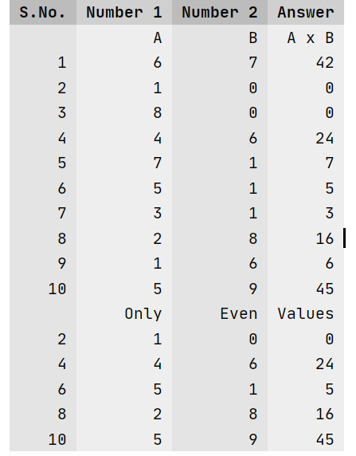
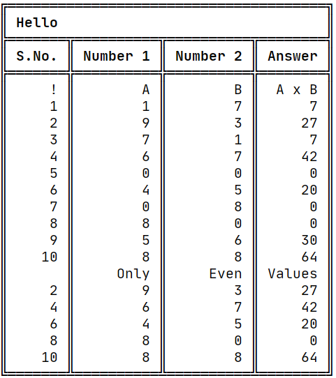
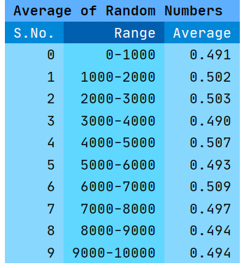

## Example T1
### Highlights
* Creating Table with Stripes
* Using `.head(#String[])` to define a single row of header elements.
* Using `.row(#String[])` to insert a single row of elements.
* Using `.iter(int:A, int:B, Function<int->String>[])` to insert `(B-A)` rows whose elements are a function on 'i' as index to yield a suitable String as it's value.
* Using `.iter(int:A, int:B, int:C, Function<int->String>[])` to insert `(⌊(B-A)/C⌋+1)` rows whose elements are a function on 'i' as index to yield a suitable String as it's value. Here instead of i being incremented by 1, it's incremented by C.
* Using `.create()` to get a String containing the table. 
### Code
```
int len = 10;

int[] Ace = new int[len];
int[] Mice = new int[len];
int[] Oce = new int[len];

for (int i = 0; i < len; i++) {
    Ace[i] = (int) (Math.random() * 10);
    Mice[i] = (int) (Math.random() * 10);
    Oce[i] = Ace[i] * Mice[i];
}

Table.stripped()
        .head("S.No.", "Number 1", "Number 2", "Answer")
        .row("", "A", "B", "A x B")
        .iter(0, len, i -> i + 1, i -> Ace[i], i -> Mice[i], i -> Oce[i])
        .row("", "Only", "Even", "Values")
        .iter(1, len, 2, i -> i + 1, i -> Ace[i], i -> Mice[i], i -> Oce[i])
        .create(log);
```

### Output



## Example T2
### Highlights
* Creating Table with using Box Drawing Characters. 
* Using `.title(#String)` to define a Title.
### Code
```
// Same Initialisation

Table.box()
        .title("Hello")
        .head("S.No.", "Number 1", "Number 2", "Answer")
        .row("!", "A", "B", "A x B")
        .iter(0, len, i -> i + 1, i -> Ace[i], i -> Mice[i], i -> Oce[i])
        .row("", "Only", "Even", "Values")
        .iter(1, len, 2, i -> i + 1, i -> Ace[i], i -> Mice[i], i -> Oce[i])
        .create(log);
```
### Output



## Example T3
### Highlights
* Creating Table with only `space`/` ` spacing. 
### Code
```
// Same initialisation.

Table.empty()
                .title("Hello")
                .head("S.No.", "Number 1", "Number 2", "Answer")
                .row("!", "A", "B", "A x B")
                .iter(0, len, i -> i + 1, i -> Ace[i], i -> Mice[i], i -> Oce[i])
                .row("", "Only", "Even", "Values")
                .iter(1, len, 2, i -> i + 1, i -> Ace[i], i -> Mice[i], i -> Oce[i])
                .create(log);
```
### Output


## Example T4
### Highlights
* Using `.bunch(T[]:mainArray, int:groupSize, Function<T[]->String>[])` to insert `(⌊mainArray.length/groupSize⌋)` rows whose elements are a function on 'i' as index and `i`th section/group on `mainArray` where the groups are of size `groupSize` to yield a suitable String as it's value.
* Using `.formatTitle(#String)` to create a custom Decoration for the table's Title.
* Using `.formatHead(#String[])` to create a custom Decoration for the table's Header elements.
* Using `.format(#String[])` to create a custom Decoration for the table's Row elements.
### Code
```
int len = 10000;        // total number of example data
int gs = len / 10;      // group size
Double[] iterations = new Double[len];
for (int i = 0; i < len; i++) iterations[i] = Math.random();

Table.stripped()
        .title("Average of Random Numbers")
        .head("S.No.", "Range", "Average")
        .bunch(iterations, len / 10,
                (gi, g) -> gi,
                (gi, g) -> (gi * len / 10) + "-" + ((gi + 1) * len / 10),
                (gi, g) -> String.format("%.3f",  avg(g) )
        )
        .formatTitle(":@4085eeb:")
        .formatHead(":@2565ae#fff:", ":@0f5298#fff:")
        .format(":@66d3fa:", ":@55d3fe:")
        .create(log);
```
```
private Double avg(Double[] g) {
    double avg = 0;
    for (Double d : g) avg += d;
    return avg / g.length;
}
```
### Output


