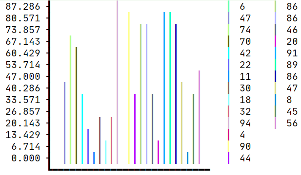
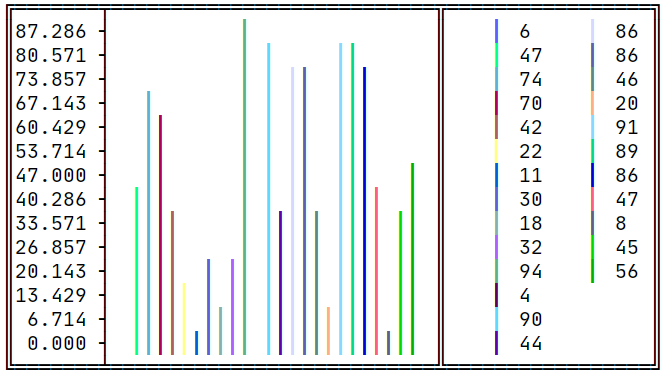
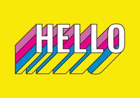

# Plooting Tools

## Bar Graphs

* To print the graph using the logger, use the `raw` method.

> Required

* `.values` -> Assign the bar values/heights.
* `.create` -> Returns a String with the Bar Graph.

> Optional

* `.title` -> Apply a title string to the graph. By default, it's empty.
* `.XLabel` -> Define a set of labels which will be shown besides the graph. By default, it shows the values given.
* `.YLabel` -> Define a set of labels which will be shown along the y axis of the graph.
* `.charHeight` -> Limit the graph height to specified characters.
* `.scale` -> Directly modify the internal scale value to adjust graph height.
* `.setBarType` -> Assign a string to set the bar character.
    * `Box.B_F` -> Full width Bar.
    * `Box.B_H` -> Half with Bar.
    * `Box.B_T` -> Thin Bar.
    * `Or Just Any String` -> Use that string as a bar piece.

### Simple Bar Graph

* To create an instance, use `Plot.BarGraph.simple()`.

```groovy
FLog log = FLog.getNew();

int[] age = new int[]{
        6, 47, 74, 70, 42, 22, 11, 30, 18, 32, 94, 4, 90, 44, 86, 86, 46, 20, 91, 89, 86, 47, 8, 45, 56
}
;

Plot.BarGraph.simple()
        .values(age)
        .create(log);
```

<br /><br />

```groovy
FLog log = FLog.getNew();

int[] age = new int[]{
        6, 47, 74, 70, 42, 22, 11, 30, 18, 32, 94, 4, 90, 44, 86, 86, 46, 20, 91, 89, 86, 47, 8, 45, 56
};

Plot.BarGraph.simple()
        .title("Visitor's Age Survey")
        .XLabel(0, age.length, i -> (age[i] > 18 ? "Adult " : "Minor ") + age[i])
        .YLabel(0, 10, i -> i * 15)
        .scale(0.08)
        .values(age)
        .create(log);
```

<br /><br />

```groovy
FLog log = FLog.getNew();

int[] age = new int[]{
        6, 47, 74, 70, 42, 22, 11, 30, 18, 32, 94, 4, 90, 44, 86, 86, 46, 20, 91, 89, 86, 47, 8, 45, 56
};

Plot.BarGraph.simple()
        .values(age)
        .charHeight(15)
        .setBarType(Box.B_T)
        .create(log);
```

<br /><br />

```groovy
FLog log = FLog.getNew();

int[] age = new int[]{
        6, 47, 74, 70, 42, 22, 11, 30, 18, 32, 94
};

Plot.BarGraph.simple()
        .values(age)
        .setBarType("Hello")
        .create(log);
```

<br /><br />

### Boxed Bar Graph

* To create an instance, use `Plot.BarGraph.box()`.

<br /><br />
<br /><br />
<br /><br />

### Image

* To print to console, an image, call the image method with 3 Int Functions which give the respective pixel
  color [0-255] at x, y. See the example for more details.

```groovy
BufferedImage i = ImageIO.read(new File("src/test/resources/NICE.png"));

FLog log = FLog.getNew();

log.raw(Plot.image(i.getWidth(), i.getHeight(), i.getWidth() / 2, i.getHeight() / 2,
        (x, y) -> (i.getRGB(x, y) >> 16) & 0xFF,  // for red
        (x, y) -> (i.getRGB(x, y) >> 8) & 0xFF,   // for green
        (x, y) -> i.getRGB(x, y) & 0xFF));        // for blue
```

original <br />
<br /><br />
the output <br />
<br /><br />
